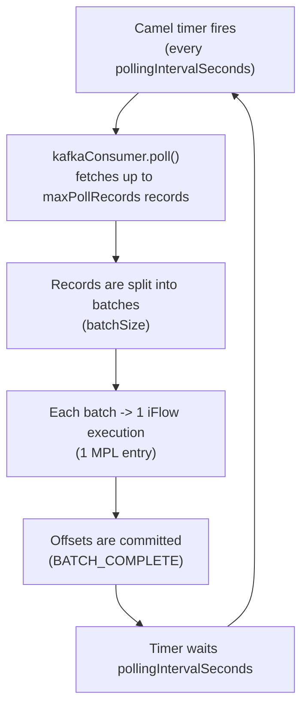
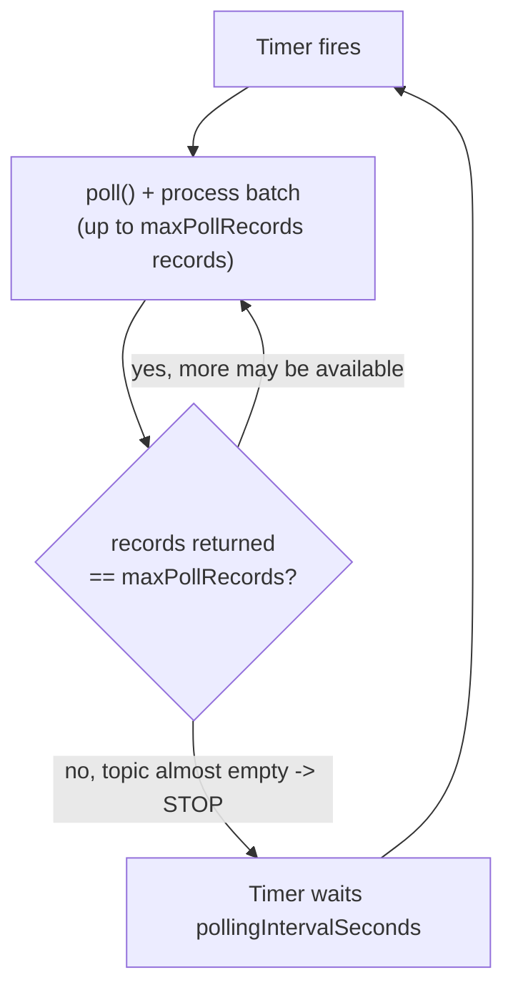
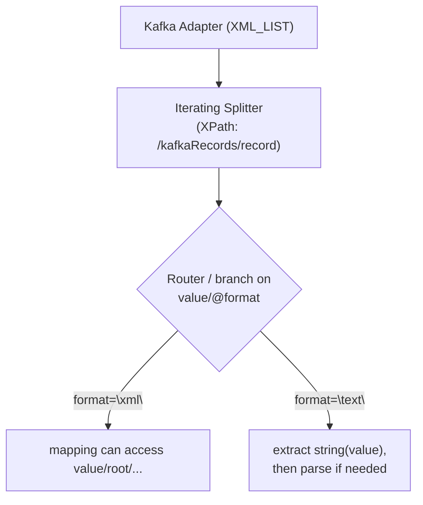

# Batch Processing & Drain Mode

## How the consumer works

The Kafka adapter polls Kafka at regular intervals (`pollingIntervalSeconds`) and processes records as batches through the CPI iFlow.



## The three configuration groups

### 1. Polling - how often records are fetched

| Parameter | Default | Description |
|---|---|---|
| **Polling Interval (Seconds)** | 5 | Wait time between poll cycles |

### 2. Kafka poll - how many records are fetched per poll

| Parameter | Default | Description |
|---|---|---|
| **Max Poll Records** | 500 | Maximum number of records per `kafkaConsumer.poll()` call |

### 3. Batch - how records are passed to the iFlow

| Parameter | Default | Description |
|---|---|---|
| **Batch Mode** | true | Multiple records per iFlow execution |
| **Batch Size** | 100 | Maximum records per batch (= per iFlow execution) |
| **Batch Timeout (ms)** | 5000 | Maximum wait time for records when the topic is empty |
| **Batch Output Format** | JSON_ARRAY | Format: `JSON_ARRAY`, `XML_LIST`, or `SPLIT_EXCHANGES` |
| **Embed XML Values** | false | For `XML_LIST`, embed XML values as parsed child elements only when set to `true` |

## How the parameters interact

### Example 1: Default configuration

| Parameter | Value |
|---|---|
| Polling Interval | 5s |
| Max Poll Records | 500 |
| Batch Size | 100 |

Per poll cycle:
- `kafkaConsumer.poll()` fetches up to 500 records
- 500 / 100 batch size = 5 iFlow executions, 5 MPL entries

Throughput: 500 records / 5s = 100 msg/s

### Example 2: High throughput

| Parameter | Value |
|---|---|
| Polling Interval | 1s |
| Max Poll Records | 2000 |
| Batch Size | 500 |

Per poll cycle: 2000 records, 4 iFlow executions

Throughput: 2000 / 1s = 2000 msg/s

### Example 3: Infrequent polling (hourly)

| Parameter | Value |
|---|---|
| Polling Interval | 3600s (1 hour) |
| Max Poll Records | 500 |
| Batch Size | 500 |
| Drain Backlog | OFF |

!!! warning
    At 10 msg/s, 36,000 messages arrive per hour. Only 500 are fetched per poll, so the backlog keeps growing.

    Solution: enable Drain Backlog (see below).

---

## Drain Backlog

### The problem: backlog during traffic spikes

Without drain mode, each poll cycle fetches at most `maxPollRecords` records. If more messages arrive than can be processed per cycle, a backlog grows:

| Metric | Value |
|---|---|
| Production | 50 msg/s |
| Consumption rate | 500 records / 30s interval = ~17 msg/s |
| Difference | 33 msg/s backlog growth |
| After 1 hour | 118,800 unprocessed messages |

### The solution: enable Drain Backlog

With `Drain Backlog = ON`, the consumer fetches all available records in a single timer fire, not just `maxPollRecords`:



Example with `maxPollRecords = 500`: iteration 1 returns 500 records (continue), iteration 2 returns 500 records (continue), ..., iteration N returns 238 records (`238 < 500` → topic is almost empty → stop).

Drain continues until the topic is almost empty. Stop conditions:

1. **Topic is empty** - `poll()` returns 0 records
2. **No more backlog** - `poll()` returns fewer than `maxPollRecords`
3. **Min Backlog threshold** - `poll()` returns fewer than `minBacklogToDrain`
4. **iFlow is stopped** - undeploy/restart in CPI

### Min Backlog to Drain — when drain should stop

With a constant message stream, drain mode could keep running because new messages keep arriving. `Min Backlog to Drain` defines: **stop drain when fewer than X records are returned.**

| Value | Behavior |
|---|---|
| **0** (Default) | Drain until the topic is empty |
| **100** | Drain stops when `poll()` returns fewer than 100 records |
| **500** | Drain stops when `poll()` returns fewer than 500 records |

Example with `Min Backlog to Drain = 100`, `Max Poll Records = 500`:

Topic has 1,200 messages, 5 msg/s continue to arrive:

| Iteration | `poll()` returns | Threshold check | Action |
|---|---|---|---|
| 1 | 500 | 500 ≥ 100 | continue |
| 2 | 500 | 500 ≥ 100 | continue |
| 3 | 220 | 220 ≥ 100 | continue |
| 4 | 30 | 30 < 100 | **STOP** |

!!! note
    30 records remain in the topic and are fetched in the next interval.
    Result: ~1,250 records processed, topic almost empty, no endless drain.

Without a threshold (default 0), drain would continue in iteration 4 and also fetch the 30 remaining records. With a threshold > 0, drain stops earlier and leaves small remaining batches for the next regular poll cycle.

### No max.poll.interval.ms risk

Kafka removes a consumer from the group if it does not call `poll()` within `max.poll.interval.ms`. The drain loop calls `kafkaConsumer.poll()` in every iteration, so this timer is reset on each pass and the loop cannot trip it.

### Limitation: Drain + AUTO commit

Drain Backlog is not compatible with `Offset Commit Strategy = Auto Commit`. The adapter rejects this combination during startup because auto commit could commit offsets before records are processed, which can cause data loss.

---

## Example scenarios with calculations

### Scenario A: Normal operation (5 msg/s)

| Parameter | Value |
|---|---|
| Polling Interval | 30s |
| Max Poll Records | 500 |
| Batch Size | 100 |
| Drain Backlog | OFF |

| Metric | Value |
|---|---|
| Arrive per 30s | 5 msg/s x 30s = 150 records |
| Fetched per poll | 150 (< 500 maxPollRecords) |
| iFlow executions | 150 / 100 = 2 (batches with 100 and 50 records) |
| MPL entries/minute | ~4 |
| Backlog | 0 (consumption rate > production rate) |

!!! note
    Drain is not needed; standard polling is sufficient.

### Scenario B: Traffic spike (200 msg/s, 2 hours)

| Parameter | Value |
|---|---|
| Polling Interval | 30s |
| Max Poll Records | 500 |
| Batch Size | 500 |
| Drain Backlog | ON |

**Without drain:**

| Metric | Value |
|---|---|
| Consumption rate | 500 records / 30s = ~17 msg/s |
| Production | 200 msg/s |
| Backlog growth | 183 msg/s |
| After 2h | 1,317,600 unprocessed messages |

**With drain:**

| Metric | Value |
|---|---|
| Arrive per 30s | 200 x 30 = 6,000 records |
| Drain fetches | all 6,000 in one timer fire: 12 iterations x 500 records x ~50ms = ~0.6 seconds |
| Pause after drain | 30s |
| Effective consumption rate | 6,000 / 30s = 200 msg/s |
| Backlog | stable at 0 |
| MPL entries | 12 per cycle, ~24/minute |

### Scenario C: 8-hour polling with 1 million messages/day

| Parameter | Value |
|---|---|
| Polling Interval | 28800s (8 hours) |
| Max Poll Records | 500 |
| Batch Size | 500 |
| Drain Backlog | ON |

| Metric | Value |
|---|---|
| Arrive per 8h | ~333,000 records |
| Drain duration | 333,000 / 500 = 666 iterations x ~50ms = ~33 seconds |
| iFlow executions | 666 |
| MPL entries | 666 |

!!! note
    During the 33s drain, ~380 new records arrive → they are fetched in the last iterations → topic is empty after ~33s → next drain after 8 hours.

### Scenario D: Testing/debugging (small batches)

| Parameter | Value |
|---|---|
| Polling Interval | 60s |
| Max Poll Records | 20 |
| Batch Size | 5 |
| Drain Backlog | ON |

100 records in the topic:

| Iteration | `poll()` returns | Action |
|---|---|---|
| 1 | 20 records | 4 batches of 5 → 4 iFlow executions |
| 2 | 20 records | 4 iFlow executions |
| ... | ... | ... |
| 5 | 20 records | 4 iFlow executions |
| 6 | 0 records | **STOP** |

!!! note
    Total: 20 iFlow executions, < 1 second

---

## Choosing values for your scenario

There is no single correct configuration — the right values depend on your message
rate, latency requirements, and how bursty the traffic is. Use the scenarios above and
the rules of thumb below to derive values for your own case instead of copying fixed
numbers.

### Rule of thumb

**Drain OFF:** when the production rate is low enough that `maxPollRecords` per cycle is sufficient:
`production rate x pollingInterval < maxPollRecords`

**Drain ON:** when traffic spikes are possible or the polling interval is long (> 60s). Drain is harmless at low volume because it stops after the first iteration when records < maxPollRecords.

**Min Backlog to Drain:** set to > 0 when a constant message stream exists and drain should not run endlessly. A typical value is equal to or smaller than maxPollRecords, for example 100 with maxPollRecords=500.

### Throughput formula

| Mode | Throughput |
|---|---|
| Without drain | `maxPollRecords / pollingIntervalSeconds` msg/s |
| With drain | Unbounded (limited by iFlow processing time + network) |

---

## Batch Output Formats

### JSON_ARRAY (default)

`JSON_ARRAY` produces a nested JSON object, not a raw array. The extra `record` level keeps the root compatible with CPI JSON-to-XML conversion.

```json
{
  "kafkaRecords": {
    "record": [
      {
        "key": "k1",
        "value": {"field": "v1"},
        "topic": "my-topic",
        "partition": 0,
        "offset": 100,
        "timestamp": 1700000000000
      },
      {
        "key": "k2",
        "value": {"field": "v2"},
        "topic": "my-topic",
        "partition": 0,
        "offset": 101,
        "timestamp": 1700000000001
      }
    ]
  }
}
```

### XML_LIST

`XML_LIST` wraps records in `<kafkaRecords count="N"><record>...</record>...</kafkaRecords>`. Each record contains `key`, `value`, `topic`, `partition`, `offset`, and `timestamp`.

By default, `embedXmlValues=false`. In this mode, every value is emitted as text/CDATA with `format="text"`, even if the value contains XML.

```xml
<?xml version="1.0" encoding="UTF-8"?>
<kafkaRecords count="2">
  <record>
    <key>k1</key>
    <value format="text"><![CDATA[<root><field>v1</field></root>]]></value>
    <topic>my-topic</topic>
    <partition>0</partition>
    <offset>100</offset>
    <timestamp>1700000000000</timestamp>
  </record>
  <record>
    <key>k2</key>
    <value format="text"><![CDATA[{"field":"v2"}]]></value>
    <topic>my-topic</topic>
    <partition>0</partition>
    <offset>101</offset>
    <timestamp>1700000000001</timestamp>
  </record>
</kafkaRecords>
```

When `embedXmlValues=true`, values that look like XML are embedded as parsed child elements and marked with `format="xml"`. Non-XML, null, or empty values still use `format="text"`.

```xml
<?xml version="1.0" encoding="UTF-8"?>
<kafkaRecords count="3">
  <record>
    <key>k1</key>
    <value format="xml"><root><field>v1</field></root></value>
    <topic>my-topic</topic>
    <partition>0</partition>
    <offset>100</offset>
    <timestamp>1700000000000</timestamp>
  </record>
  <record>
    <key>k2</key>
    <value format="text"><![CDATA[{"field":"v2"}]]></value>
    <topic>my-topic</topic>
    <partition>0</partition>
    <offset>101</offset>
    <timestamp>1700000000001</timestamp>
  </record>
  <record>
    <key>k3</key>
    <value format="text"></value>
    <topic>my-topic</topic>
    <partition>0</partition>
    <offset>102</offset>
    <timestamp>1700000000002</timestamp>
  </record>
</kafkaRecords>
```

**CPI iFlow pattern:**



Alternative filter: `/kafkaRecords/record[value/@format='xml']` to process only XML records.

!!! warning "XML well-formedness"
    XML values must be well-formed when `embedXmlValues=true`. The adapter only uses a lightweight check before embedding; malformed XML content can make the batch XML invalid.

### SPLIT_EXCHANGES

Each record is processed individually as its own iFlow exchange. There is no batching wrapper, but polling remains efficient because `maxPollRecords` are fetched at once.

---

## Batch Timeout - common misunderstanding

`Batch Timeout (ms)` is not the time the adapter waits to collect records. It is the maximum time `kafkaConsumer.poll()` waits for the Kafka broker:

- Topic has records: `poll()` returns immediately (milliseconds)
- Topic is empty: `poll()` waits up to Batch Timeout ms, then returns 0 records

The parameter only affects idle detection for an empty topic.

---

## Offset Commit

With `commitStrategy = BATCH_COMPLETE` (recommended), offsets are committed only after each batch has been processed successfully. If an error occurs, records from the failed batch are delivered again on the next poll (at-least-once semantics).

With `commitStrategy = AUTO`, Kafka commits periodically in the background, independently of whether processing succeeded. This is not recommended for production-critical scenarios.
