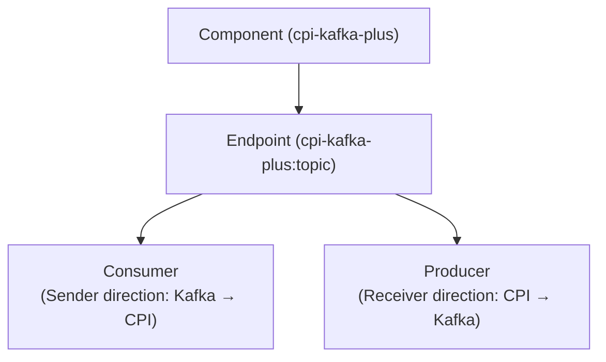

# Kafka Adapter Plus

Custom Apache Kafka adapter for SAP Cloud Integration (CPI) built with the SAP Adapter Development Kit (ADK).

## Key Features

- **Kafka Sender Adapter** — Consumes messages from Kafka topics and feeds them into a CPI integration flow (used on a Sender channel)
- **Kafka Receiver Adapter** — Publishes integration flow messages to Kafka topics (used on a Receiver channel)
- **Batch Processing** — Combine multiple Kafka records into a single message (JSON array or XML list) for higher throughput, or process each record as its own IFlow execution (no batching) when per-record handling is required
- **Avro / Schema Registry** — Confluent Schema Registry integration for Avro serialization and deserialization
- **Security** — SASL/PLAIN, SASL/SCRAM, SSL/TLS, and mTLS authentication
- **At-Least-Once Delivery** — Manual offset commit after successful message processing
- **CPI Tracing** — Full MPL (Message Processing Log) integration
- **Header-Based Routing** — Dynamic topic, key, and partition override via exchange headers

## Architecture

The adapter follows the standard Apache Camel component model:

## Next Steps

- [Getting Started](getting-started.md) — Build the adapter and deploy it to CPI
- [Configuration Reference](configuration.md) — All available adapter parameters
- [Features](features/batch-processing.md) — Detailed feature documentation
